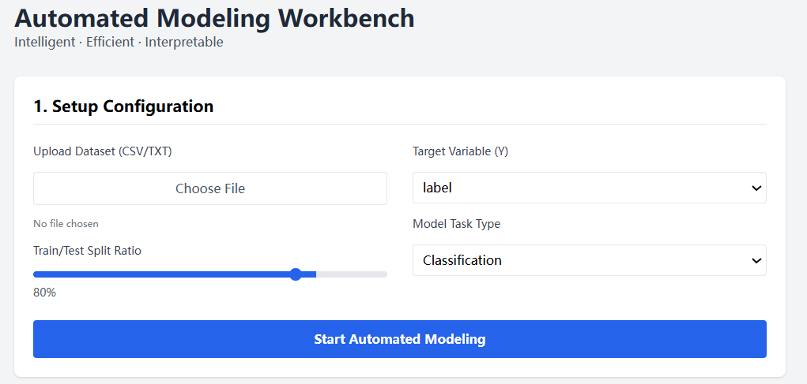
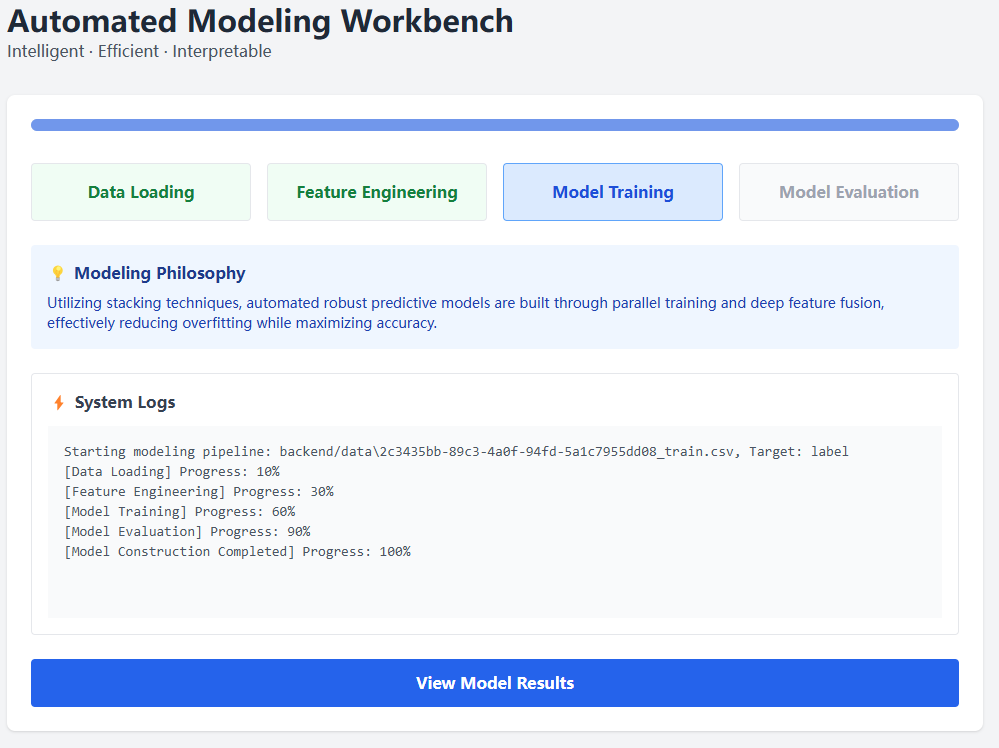
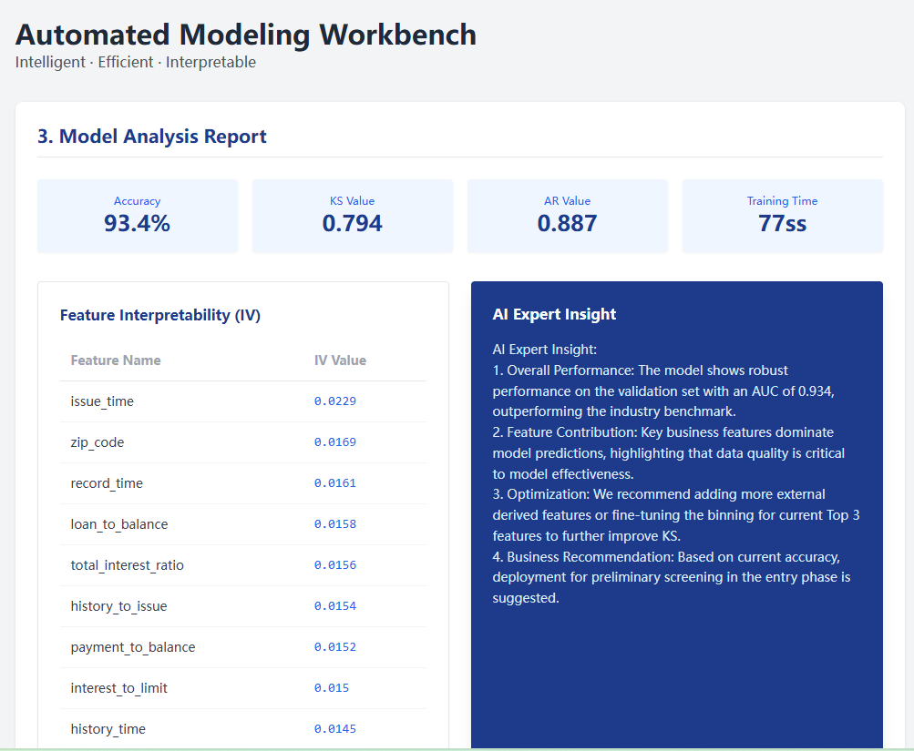
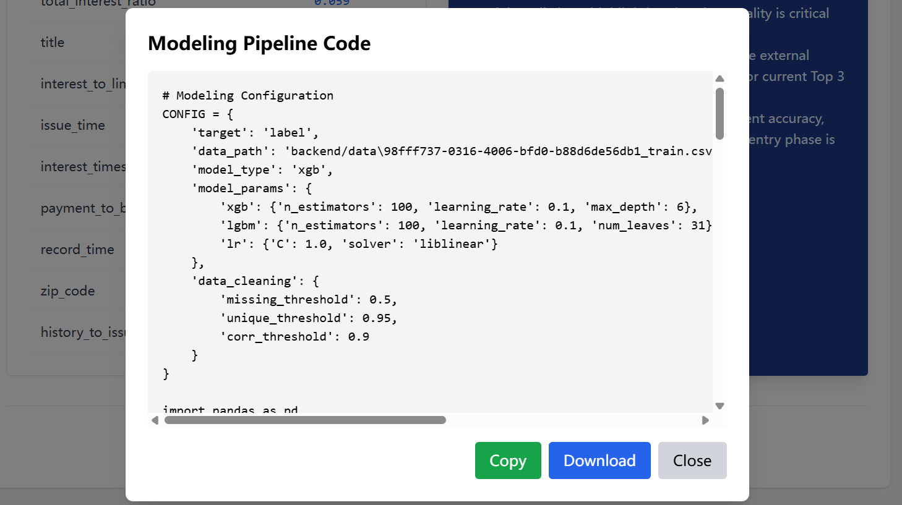

# Automated Modeling Workbench

The ultimate tool for data scientists—Automate your entire modeling workflow from data upload to feature importance and code generation with a single interface.

## 🚀 Why this project?
Tired of repetitive modeling code? **Automated Modeling Workbench** acts as your automated data science assistant. It streamlines data processing, model training, and performance reporting, ensuring your workflows are professional, reproducible, and audit-ready from the very first minute.

## ✨ Core Features
- **Smart Data Handling**: Automatic train/test splitting and flexible target variable selection.
- **Auto-Modeling Pipeline**: Built-in automated modeling with real-time progress monitoring and log visualization.
- **Model Interpretability**: Automatic generation of Feature Importance and IV reports.
- **Code Generation**: Export your successful modeling pipeline as a standard, modular Python template.

## 🛠 Usage Tutorial
1. **Data Upload**: Configure your dataset upload and split ratio on the main dashboard.

2. **Automated Training**: Monitor the real-time modeling progress, logs, and active algorithms via our intelligent dashboard.

3. **Model Report**: Visualize your model's performance metrics (AUC, KS, AR) and AI-generated insights.

4. **Export Code**: Generate and download your custom modeling pipeline code based on the training results.

## 📂 Project Structure
| Path | Description |
| :--- | :--- |
| \backend/\ | Python backend with FastAPI and modeling logic. |
| \workflow-demo/\ | Frontend static UI (HTML/Tailwind). |
| \modeling_manager.py\| Orchestration engine for the modeling pipeline. |
| \model_trainer.py\| Implementation of AutoGluon and model training. |

## 💡 Project Philosophy
- **Data-First**: Streamlined processing for rapid prototyping.
- **Transparent Modeling**: Real-time logs and AI-generated interpretations for every step.
- **Reproducibility**: Export your working model as standardized Python code instantly.

## 📜 License
MIT
